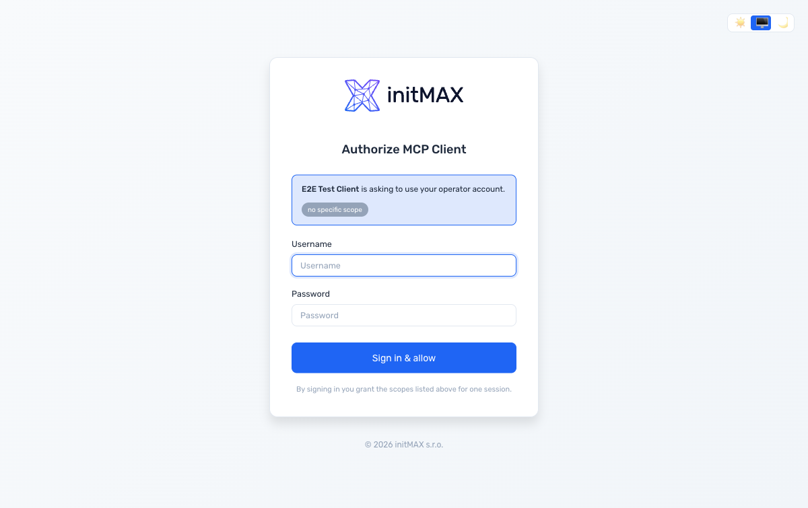

# Connecting ChatGPT to a Zabbix MCP Server

This guide walks an operator through plugging a Zabbix MCP server
running v1.28+ with `[oauth].enabled = true` into ChatGPT's "Custom
Apps" feature. ChatGPT auto-discovers everything from the
`/.well-known/...` endpoints; the operator only types the URL.

## Prerequisites

- ChatGPT plan that exposes Custom Apps: Plus / Pro / Business /
  Enterprise / Edu (Developer mode).
- Zabbix MCP server running v1.28 or newer with
  `[oauth].enabled = true`. Confirm with
  `https://<your-mcp-host>/.well-known/oauth-authorization-server` -
  it must return JSON over HTTPS, not 404.
- Server reachable from the OpenAI cloud over **standard port 443
  HTTPS**. Non-standard ports (`:8443`, `:9443`, ...) are rejected
  by ChatGPT's discovery probe even when curl works.
- Publicly-trusted TLS certificate (Let's Encrypt / commercial CA).
  Self-signed certs are rejected. See [`docs/OAUTH.md`](OAUTH.md)
  for reverse-proxy patterns (Apache, Nginx, Caddy).
- A Zabbix MCP admin-portal user (`[admin.users.<name>]` in
  `config.toml`). The operator signs in to that account during the
  authorize step.

## Walkthrough

### 1. Open the Custom Apps dialog

In ChatGPT: **Settings -> Apps & Connectors -> Advanced settings**,
toggle **Developer mode** on, click **+ Create**. The "New App"
dialog opens.

### 2. Fill in the basics

| Field | Value |
|---|---|
| Name | Whatever you want; appears in the chat tool menu (e.g. "Zabbix"). |
| Description (optional) | Free-form. |
| MCP Server URL | `https://<your-mcp-host>/mcp` - **standard 443, no port**. |
| Authentication | **OAuth**. |

Do NOT put the issuer URL (`/`) or the discovery URL
(`/.well-known/...`) in the MCP Server URL field - ChatGPT expects
the protocol endpoint (`/mcp`).

### 3. Advanced OAuth settings

Click **Advanced OAuth settings** to expand. This is where ChatGPT
auto-discovers your server:

- **Client registration -> Registration method**: leave as
  **Dynamic Client Registration (DCR)**. The server implements
  RFC 7591 dynamic registration so ChatGPT auto-creates a public
  client (PKCE-only, no shared secret) on first use.
- Do NOT switch to "User-Defined OAuth Client" unless you know
  why - it requires you to paste a `client_id` you registered
  manually.
- Default scopes: leave empty. The server's authorization server
  metadata advertises no `scopes_supported`, so ChatGPT requests
  the operator's full grant.

If the panel says **"DCR is unavailable until a Registration URL
is present in the OAuth endpoints section below"** the discovery
probe failed. Common causes:

| Symptom | Cause | Fix |
|---|---|---|
| "DCR is unavailable" + "CIMD is unavailable" | ChatGPT cannot reach the server | Verify `https://<host>/.well-known/oauth-authorization-server` returns JSON in your browser. If it does, check the URL has no `:port`. |
| "Error fetching OAuth configuration: Cannot connect to host ... ssl:default [None]" | Non-standard port, self-signed cert, or hostname mismatch | Move OAuth + MCP behind standard port 443 with a publicly-trusted TLS cert. See `docs/OAUTH.md`. |
| "Loading..." spins forever | Discovery URL serves the wrong JSON or returns 404 | The server is not on v1.28, or `[oauth].enabled` is false. |

### 4. Accept the disclaimer

Tick **"I understand and want to continue"** under "Custom MCP
servers introduce risk" and click **Create**.

### 5. Sign in to the MCP server

ChatGPT opens a browser tab pointing at your MCP server's
`/oauth/login` page. The page renders in the same theme as the
admin portal:



Type the **admin-portal username + password**. After "Sign in &
allow", the browser redirects back to ChatGPT.

The operator may close the tab once the success page appears -
ChatGPT has already received the authorization code via the
redirect.

### 6. Use the connector

Back in ChatGPT, the connector status flips to **Connected** and
the Zabbix MCP tools appear in the chat tool menu. Try:

> "What problems are currently active?"

ChatGPT picks `problem_active_get` from the catalog (the
description steers it there) and renders host names + severity
labels.

## What is happening on the wire

For an operator who wants to understand or troubleshoot, here is
the actual sequence of HTTP calls. Every step is exercised by
`tests/integration/test_oauth_e2e.py` so a regression in any of
them fails CI before it reaches production.

```
1. ChatGPT  ->  GET /.well-known/oauth-authorization-server   (RFC 8414)
   ChatGPT  ->  GET /.well-known/oauth-protected-resource     (RFC 9728)

2. ChatGPT  ->  POST /register                                (RFC 7591)
                  { redirect_uris: [ chatgpt callback ],
                    client_name:   "<the name you typed>",
                    grant_types:   ["authorization_code","refresh_token"],
                    token_endpoint_auth_method: "none" }
   MCP      ->  201 { client_id: <fresh uuid> }   # public client, no secret

3. ChatGPT generates PKCE verifier + S256 challenge.

4. ChatGPT  ->  GET /authorize?response_type=code&client_id=...&redirect_uri=...
                          &code_challenge=...&code_challenge_method=S256&state=...
   MCP      ->  302 to /oauth/login?request_id=<opaque>

5. Browser  ->  GET /oauth/login?request_id=<opaque>
   MCP      ->  200 + login form

6. Browser  ->  POST /oauth/login (username, password, request_id)
   MCP      ->  302 to <chatgpt callback>?code=...&state=...

7. ChatGPT  ->  POST /token
                  grant_type=authorization_code&client_id=...&code=...
                  &redirect_uri=...&code_verifier=<PKCE verifier>
   MCP      ->  200 { access_token, token_type=Bearer, expires_in=3600,
                       refresh_token, scope }

8. ChatGPT  ->  POST /mcp  (Authorization: Bearer <access_token>)
                  initialize / tools/list / tools/call ...

9. (Hourly)
   ChatGPT  ->  POST /token
                  grant_type=refresh_token&client_id=...&refresh_token=...
   MCP      ->  200 { new access + new refresh; old refresh evicted,
                       old access cascade-invalidated }
```

Three security properties worth knowing:

- **PKCE S256 is mandatory.** A client that does not advertise
  `code_challenge_methods_supported` containing `S256` is refused
  by the framework before it can ever request a token.
- **Token audience binding.** Every issued access token is bound
  via the `aud` claim to `[server].public_url`. A token leaked from
  one MCP deployment cannot be replayed against another.
- **Refresh-token rotation.** Each refresh-token use rotates both
  tokens and evicts the old access token in the same step. A
  stolen-then-replayed refresh token at most pulls one fresh
  access token before the legitimate client's next refresh
  produces a different one (the AS will then mint two parallel
  chains - operator-side detection of refresh reuse is on the
  v1.29 backlog).

## Adding more OAuth-capable clients

The same flow works for:

- **Claude Desktop** -> Settings -> Customize -> Connectors ->
  + Add custom connector -> paste the same `https://<host>/mcp`
  URL, pick **OAuth**.
- **MCP Inspector** (`npx @modelcontextprotocol/inspector`) ->
  Connect to `https://<host>/mcp`, pick OAuth, the inspector runs
  the same authorize flow.
- **Custom CLIs / SDKs** that implement MCP 2025-11-25 -> point
  the SDK at the URL; the SDK's auth helper handles discovery on
  its own.

Bearer-token clients (`[tokens.X]` in `config.toml`) keep working
alongside OAuth - existing CLI scripts, n8n workflows, and any
legacy integration need no change.

## Operator hygiene

- Every dynamically-registered ChatGPT instance becomes an entry
  in `[oauth_clients.<id>]` config sections, visible in the admin
  portal under **OAuth Clients** (`/oauth-clients`). Review the
  list periodically; revoke clients you no longer recognise.
- Revoking a client wipes its config row AND every access /
  refresh token it holds in memory, so the next request from the
  ChatGPT side fails with 401 and the operator has to reconnect
  (which goes through a fresh login + consent).
- Operator login attempts on `/oauth/login` are rate-limited to
  5 failed attempts per IP per 5-minute rolling window (parity
  with the admin portal's own login).
- All login + revoke actions land in the audit log
  (`/var/log/zabbix-mcp/audit.log`).

## See also

- [`docs/OAUTH.md`](OAUTH.md) - server-side setup,
  reverse-proxy patterns, RFC reference, security checklist
- [`tests/integration/test_oauth_e2e.py`](../tests/integration/test_oauth_e2e.py) -
  executable specification of the steps above; what we test on
  every release
